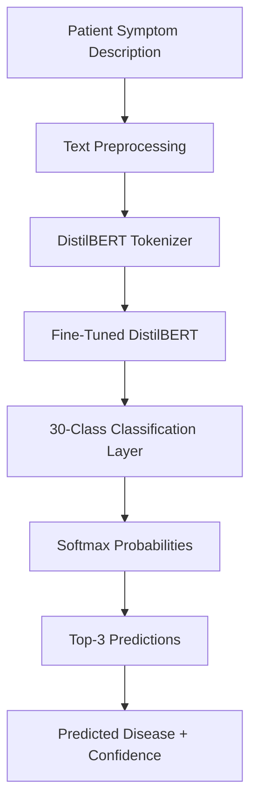
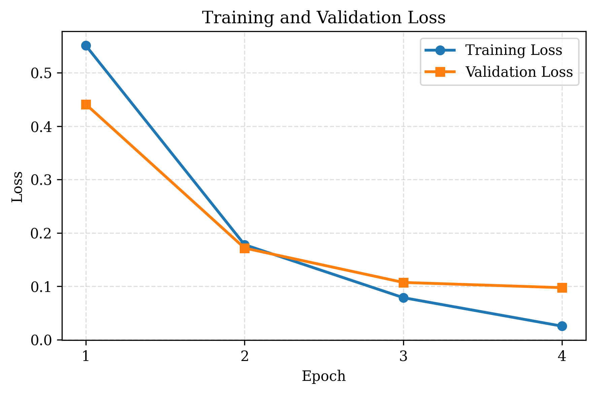
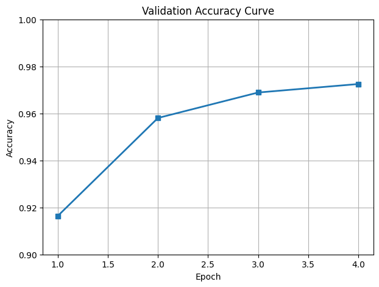
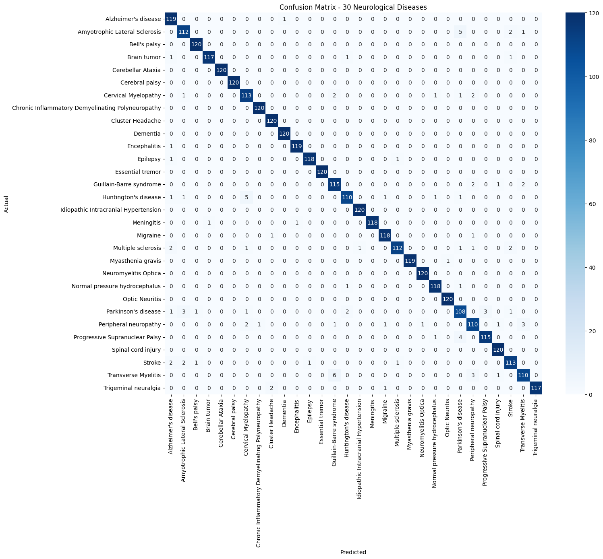
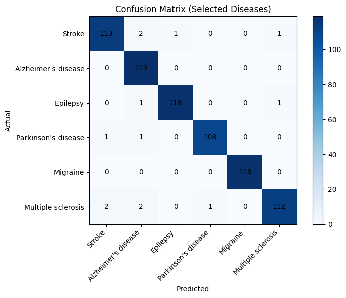
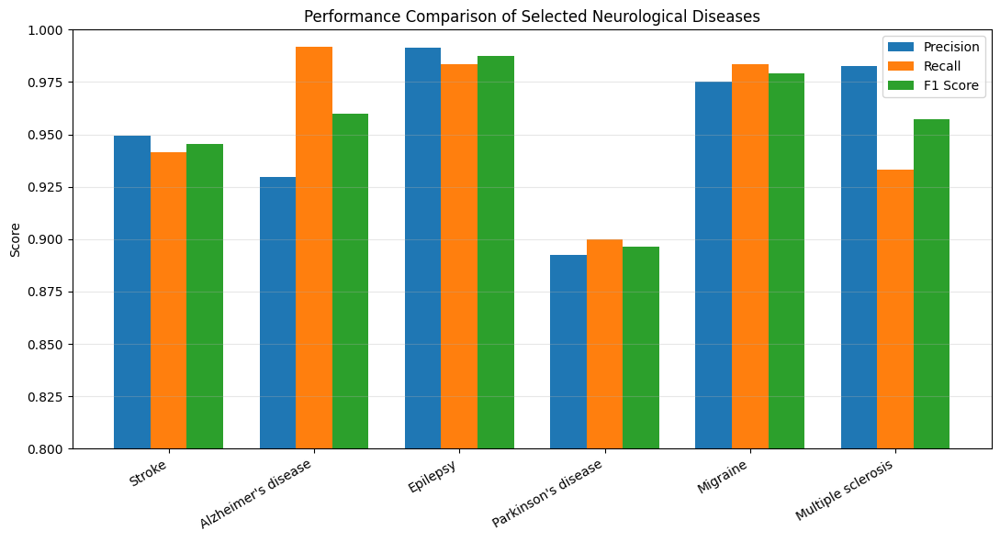
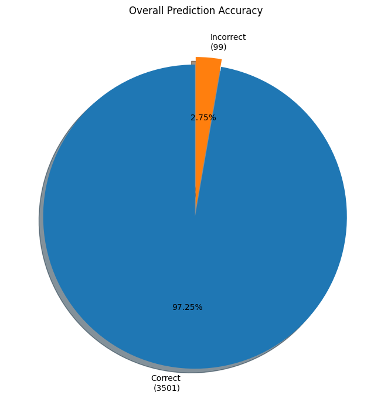

# 🧠 AI-Based Neurological Disease Prediction System

### NLP-Based Neurological Disease Classification Using DistilBERT

An end-to-end Natural Language Processing system that analyzes **patient-written symptom descriptions** and predicts the most probable neurological disease using a fine-tuned **DistilBERT transformer model**.

> ⚠️ **Academic Project:** This system is designed for educational and machine-learning research purposes. Its predictions are not medical diagnoses and should not replace evaluation by a qualified healthcare professional.

<p align="center">
  
  
  
  
  
</p>

<!-- Optional: add a demo screenshot here once you have one

-->

---

## 📌 Project Overview

Neurological diseases can present with a wide range of symptoms, and patients often describe these symptoms using informal, incomplete, or non-medical language.

This project explores whether a transformer-based NLP model can learn meaningful disease patterns directly from **natural-language patient symptom descriptions**.

The system takes text such as:

> *"My handwriting has become much smaller, I don't swing one arm while walking, and getting out of a chair has become difficult."*

and produces a ranked prediction such as:

```text
🥇 Parkinson's disease             99.35%
🥈 Amyotrophic Lateral Sclerosis    0.31%
🥉 Progressive Supranuclear Palsy   0.06%
```

The core classifier is based on **DistilBERT**, fine-tuned specifically for a 30-class neurological disease classification task.

---

## 🎯 Objectives

- Develop an NLP-based neurological disease classification system
- Create a disease-focused symptom dataset suitable for transformer-based text classification
- Fine-tune a pretrained DistilBERT model for multi-class classification
- Build a complete preprocessing → training → evaluation → inference pipeline
- Evaluate the model using accuracy, precision, recall, and F1-score
- Analyze disease-level errors using confusion matrices
- Develop an inference system capable of returning Top-3 predictions with confidence scores
- Investigate the feasibility of using natural-language symptom descriptions for neurological disease classification

---

## ✨ Key Features

| Feature | Description |
|---|---|
| 🧠 **Transformer-Based Classification** | Fine-tuned DistilBERT for multi-class neurological disease classification |
| 🏥 **30 Neurological Disease Classes** | Distinguishes between 30 distinct conditions |
| 📝 **Patient-Style Natural Language Input** | Accepts free-form symptom descriptions — no fixed symptom checklist |
| 🎯 **Top-3 Predictions** | Returns the three most probable disease classes |
| 📊 **Confidence Scores** | Each prediction is accompanied by the model's probability score |
| 📈 **Detailed Evaluation** | Accuracy, precision, recall, F1, confusion matrices, and loss curves |
| 🔍 **Disease-Level Error Analysis** | Confusion matrices highlight diseases that are harder for the model to separate |

---

## 🏗️ System Architecture



---

## 🔬 Methodology

```text
Raw Dataset
   ↓
Dataset Cleaning
   ↓
Duplicate Removal
   ↓
Disease Label Normalization
   ↓
Label Encoding
   ↓
Train / Test Split
   ↓
DistilBERT Tokenization
   ↓
DistilBERT Fine-Tuning
   ↓
Model Evaluation
   ↓
Error Analysis
   ↓
Inference
```

---

## 📚 Dataset

Finding a sufficiently large public dataset of **patient-written neurological symptom descriptions** was difficult, so a custom neurological symptom dataset was built for this project.

The dataset contains **17,998 patient-style symptom descriptions** (≈18,000) across 30 neurological disease classes, cleaned, standardized, deduplicated, and label-encoded before training.

### 🧩 Description Diversity

To prevent the classifier from learning only obvious textbook descriptions, symptom text was written across five difficulty levels:

| Category | Approx. Proportion | Description |
|---|---:|---|
| Clear descriptions | 40% | Explicit descriptions of characteristic symptoms |
| Moderate descriptions | 25% | Natural descriptions with several useful clues |
| Short descriptions | 15% | Limited information, only a few symptoms |
| Confusing descriptions | 10% | Symptoms overlapping with other diseases |
| Difficult / indirect descriptions | 10% | Vague, unstructured, everyday patient language |

### 🧹 Data Preprocessing

- Removing duplicate samples
- Handling missing values
- Standardizing disease names
- Correcting inconsistent capitalization
- Cleaning textual data
- Encoding disease labels
- Creating a numerical label mapping
- Splitting the dataset into training and testing subsets

```text
Training samples : 14,398
Testing samples  :  3,600
Total             : 17,998
```

The test set was kept fully separate from training so the final model could be evaluated on unseen examples.

---

## 🦠 Disease Classes

<details>
<summary><b>Click to expand all 30 disease classes</b></summary>

1. Alzheimer's disease
2. Amyotrophic Lateral Sclerosis
3. Bell's palsy
4. Brain tumor
5. Cerebellar Ataxia
6. Cerebral palsy
7. Cervical Myelopathy
8. Chronic Inflammatory Demyelinating Polyneuropathy
9. Cluster Headache
10. Dementia
11. Encephalitis
12. Epilepsy
13. Essential tremor
14. Guillain-Barré syndrome
15. Huntington's disease
16. Idiopathic Intracranial Hypertension
17. Meningitis
18. Migraine
19. Multiple sclerosis
20. Myasthenia gravis
21. Neuromyelitis Optica
22. Normal pressure hydrocephalus
23. Optic Neuritis
24. Parkinson's disease
25. Peripheral neuropathy
26. Progressive Supranuclear Palsy
27. Spinal cord injury
28. Stroke
29. Transverse Myelitis
30. Trigeminal neuralgia

</details>

---

## 🤖 Model

| Property | Value |
|---|---|
| Base model | `distilbert-base-uncased` |
| Task | Multi-class text classification |
| Output classes | 30 |

DistilBERT was selected for its strong balance of NLP performance, model size, training speed, inference speed, and computational requirements.

### 🔤 Tokenization

Patient descriptions are converted into tokens using the pretrained DistilBERT tokenizer, generating `input_ids` and `attention_mask`, which are passed to the fine-tuned transformer model.

---

## ⚙️ Training Configuration

| Parameter | Value |
|---|---|
| Base Model | DistilBERT (`distilbert-base-uncased`) |
| Task | Multi-class classification |
| Number of Classes | 30 |
| Training Epochs | 4 |
| Training Samples | 14,398 |
| Test Samples | 3,600 |
| Environment | Google Colab (Tesla T4 GPU) |
| Framework | PyTorch |
| NLP Library | Hugging Face Transformers |

### 📈 Training Progress

| Epoch | Training Loss | Validation Loss | Validation Accuracy |
|---:|---:|---:|---:|
| 1 | 0.551338 | 0.441242 | 91.64% |
| 2 | 0.177924 | 0.171634 | 95.81% |
| 3 | 0.078686 | 0.107226 | 96.89% |
| 4 | 0.025291 | 0.097427 | **97.25%** |

```text
Validation Accuracy Progression
91.64% → 95.81% → 96.89% → 97.25%
```




Training loss decreases substantially across the four epochs while validation loss also decreases — indicating the model learned effectively without overfitting.

---

## 🧪 Model Evaluation

Evaluated on **3,600 held-out test samples** using accuracy, precision, recall, and F1-score.

### 🏆 Final Performance

| Metric | Result |
|---|---:|
| Test Accuracy | **97.25%** |
| Macro Precision | ~97% |
| Macro Recall | ~97% |
| Macro F1 | ~97% |
| Weighted Precision | ~97% |
| Weighted Recall | ~97% |
| Weighted F1 | ~97% |
| Test Samples | 3,600 |
| Disease Classes | 30 |

```text
3,501 correct predictions
   99 incorrect predictions
```

### 📊 Classification Report

Full per-class precision, recall, F1, and support: [`evaluation/classification_report.csv`](evaluation/classification_report.csv)

### 🔲 Full Confusion Matrix



Rows represent the actual disease, columns represent the predicted disease. Diagonal cells indicate correct classifications; off-diagonal cells indicate errors. The strong diagonal pattern shows the majority of test samples were classified correctly.

### 🔍 Selected Disease Analysis

A focused confusion matrix for six representative diseases — Stroke, Alzheimer's disease, Epilepsy, Parkinson's disease, Migraine, and Multiple sclerosis:



### 📊 Precision, Recall & F1 by Class



### 🥧 Overall Accuracy



```text
Accuracy : 97.25%
Error    :  2.75%
```

---

## 🧠 Inference Pipeline

```text
Patient enters symptoms
        ↓
DistilBERT Tokenizer
        ↓
Fine-Tuned DistilBERT
        ↓
Classification probabilities
        ↓
Top-3 predictions
        ↓
Disease names + confidence
```

**Example input:**

> "My handwriting has become much smaller than it used to be. My family says I don't swing one arm while walking anymore. Getting out of a chair has become much harder than before."

**Example output:**

```text
🥇 Parkinson's disease             99.35%
🥈 Amyotrophic Lateral Sclerosis    0.31%
🥉 Progressive Supranuclear Palsy   0.06%
```

---

## 🧪 Error Analysis

The model produced **99 incorrect predictions out of 3,600 test samples**, largely involving diseases with overlapping neurological symptoms:

```text
Amyotrophic Lateral Sclerosis  ↔  Stroke
Parkinson's disease            ↔  Huntington's disease
Peripheral neuropathy          ↔  Transverse Myelitis
Stroke                         ↔  Alzheimer's disease
```

> Similar symptoms can occur across multiple neurological conditions — high overall accuracy does not mean every individual disease is equally easy to classify. Disease-level precision, recall, and confusion matrices were analyzed alongside overall accuracy for this reason.

---

## 📁 Repository Structure

```text
neurological-disease-prediction/
│
├── README.md
├── requirements.txt
├── .gitignore
│
├── notebooks/
│   ├── 01_model_training.ipynb
│   ├── 02_model_evaluation.ipynb
│   └── 03_model_inference.ipynb
│
└── evaluation/
    ├── confusion_matrix.png
    ├── selected_6_confusion_matrix.png
    ├── training_validation_loss.png
    ├── validation_accuracy.png
    ├── precision_recall_f1.png
    ├── accuracy_pie.png
    └── classification_report.csv
```

---

## 🛠️ Technology Stack

| Category | Tools |
|---|---|
| Programming | Python |
| Machine Learning | PyTorch, Scikit-Learn |
| NLP | Hugging Face Transformers, DistilBERT |
| Data Processing | Pandas, NumPy |
| Visualization | Matplotlib, Seaborn |
| Model Serialization | Joblib |
| Development Environment | Google Colab, Google Drive |

---

## 🔄 Reproducibility

| Notebook | Contents |
|---|---|
| [`01_model_training.ipynb`](notebooks/01_model_training.ipynb) | Data preparation, tokenization, DistilBERT configuration, fine-tuning |
| [`02_model_evaluation.ipynb`](notebooks/02_model_evaluation.ipynb) | Test-set evaluation, classification metrics, confusion matrices, visualization |
| [`03_model_inference.ipynb`](notebooks/03_model_inference.ipynb) | Inference pipeline for generating predictions on new symptom descriptions |

The notebooks reference project files stored in Google Drive, since Google Colab was the primary development and training environment.

---

## 📦 Dataset Availability

The complete dataset is **not included in this repository**. It was custom-generated/curated specifically for this academic project and contains patient-style symptom descriptions. This repository contains the preprocessing and modeling workflow rather than the full dataset itself.

---

## ⚠️ Limitations

**1. Synthetic / Curated Dataset**
Symptom descriptions were generated/curated for this project rather than collected from a large clinical population — test accuracy should not be interpreted as clinical diagnostic accuracy.

**2. Text-Only Input**
The model does not currently analyze MRI/CT scans, EEG signals, blood tests, clinical examination, medical history, or genetic information.

**3. Symptom Overlap**
Several neurological diseases share similar symptoms, which can lead to difficult classification cases even when the model performs well overall.

**4. No Clinical Validation**
The model has not been clinically validated or evaluated by medical professionals.

**5. Confidence ≠ Medical Certainty**
The model's confidence score reflects its classification probability distribution — not the actual probability a patient has a given disease.

---

## 🔐 Responsible AI Disclaimer

This project is an academic demonstration of transformer-based NLP. It is **not a medical diagnostic device**. Predictions should not be used to make medical decisions, begin treatment, stop medication, or replace professional medical evaluation. Anyone with concerning neurological symptoms should seek assessment from a qualified healthcare professional.

---

## 👨‍💻 Project Status — Version 1 (Machine Learning Model)

| Component | Status |
|---|---|
| Dataset Engineering | ✅ Completed |
| Data Cleaning | ✅ Completed |
| Label Encoding | ✅ Completed |
| Train/Test Split | ✅ Completed |
| DistilBERT Fine-Tuning | ✅ Completed |
| Model Evaluation | ✅ Completed |
| Confusion Matrix Analysis | ✅ Completed |
| Error Analysis | ✅ Completed |
| Inference Pipeline | ✅ Completed |
| Top-3 Predictions | ✅ Completed |
| Confidence Scores | ✅ Completed |

---

## 🚀 Future Improvements

- Evaluation on real-world clinical datasets
- External validation using independent datasets
- Improved handling of ambiguous symptoms
- Additional neurological disease classes
- Calibration of confidence scores
- Better out-of-distribution detection
- More extensive hyperparameter optimization
- Human/clinical expert evaluation
- Deployment as a production application (planned React/Next.js frontend + FastAPI backend, PDF reports, and multimodal input)

---

## ⭐ Final Result

This project demonstrates that a fine-tuned transformer model can learn meaningful patterns from natural-language symptom descriptions and achieve strong classification performance across a multi-class neurological disease dataset.

<p align="center">
  <b>Final Test Accuracy: 97.25%</b><br/>
  30 Neurological Disease Classes • 3,600 Held-Out Test Samples • DistilBERT-Based NLP Classifier
</p>

---

## ⚕️ Disclaimer

**For academic and educational purposes only.** This system does not provide medical diagnosis and should not be used as a substitute for professional medical advice, diagnosis, or treatment.
